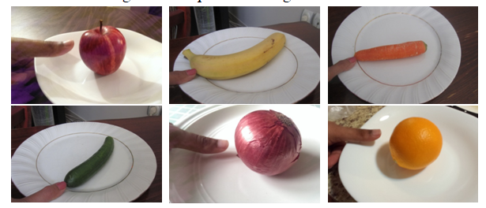
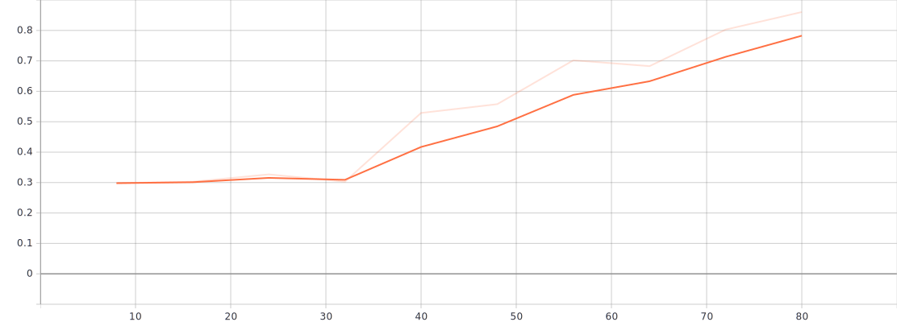
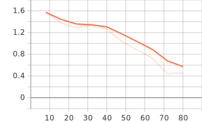

# PRODIGY_ML_05

# Food Recognition and Calorie Estimation Model

## Overview

This project involves developing a machine learning model that can recognize food items from images and estimate their calorie content. It aims to help users track their dietary intake and make informed food choices.

+ ### Data collection
For this project I used two datasets:
1. [FOODD]()
2. ECUST Food Dataset (ECUSTFD)

>In this project I used 7 food items like apple, banana, carrot, cucumber, onion, orange and tomato which details given in table below
  
  
## Food type

 | Fruits  | Density | Calorie| Label |	Shape   |
 | ------- | ------- | ------ | ----- | --------|
 | Apple   |  0.609  |   52   |   1   | Sphere  | 
 | Banana  |  0.94   |   89   |   2   | Cylinder|
 | Carrot  |  0.641  |   41   |   3   | Cylinder|
 | Cucumber|  0.641  |   16   |   4   | Cylinder|
 | Onion   |  0.513  |   40   |   5   | Sphere  |
 | Orange  |  0.482  |   47   |   6   | Sphere  |
 | Tomato  |  0.481  |   18   |   7   | Sphere  |

#### Sample food images in dataset:

### Accuracy 

### Loss

## Features

- *Food Item Recognition:* Identifies food items from uploaded images.
- *Calorie Estimation:* Estimates the calorie content based on the recognized food item.

## Getting Started

### Prerequisites

- Python 3.x
- TensorFlow or PyTorch
- Other dependencies listed in requirements.txt
